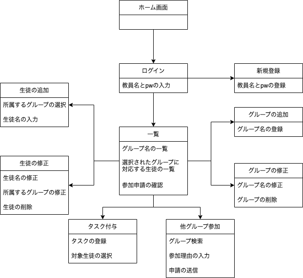

# study-ddd-with-java
javaを用いたドメイン駆動設計のお勉強

## 目的

- 実際のwebアプリの構築を通じて、ドメイン駆動設計の学習を行う
- Java特有のメソッドや構造などを理解する

## TODO

- [ ] グループの作成
- [ ] 生徒の追加
- [ ] 生徒にタスクを付与

## アプリの詳細

### 概要

アプリ名 : School

教員となるユーザが新規登録を行う。
その後、自身の保有するクラス(教室)を作成し、そのクラスに存在する生徒を登録する。

教員はログイン後、クラスの更新(追加、修正、削除)を行うことができる。また生徒の更新も可能。

教員は生徒一人一人にタスクを付与することができる。
生徒ひとりにつきタスクは複数個保有することができ、タスク一つにつき生徒は複数人存在することができる。
具体的には、まずタスクを1つ以上作成する。その後、そのタスクを付与させる生徒を1人以上選択する。

教員は生徒を選択することでその生徒が保有しているタスクの閲覧、更新を行うことができる。

### 画面遷移図

